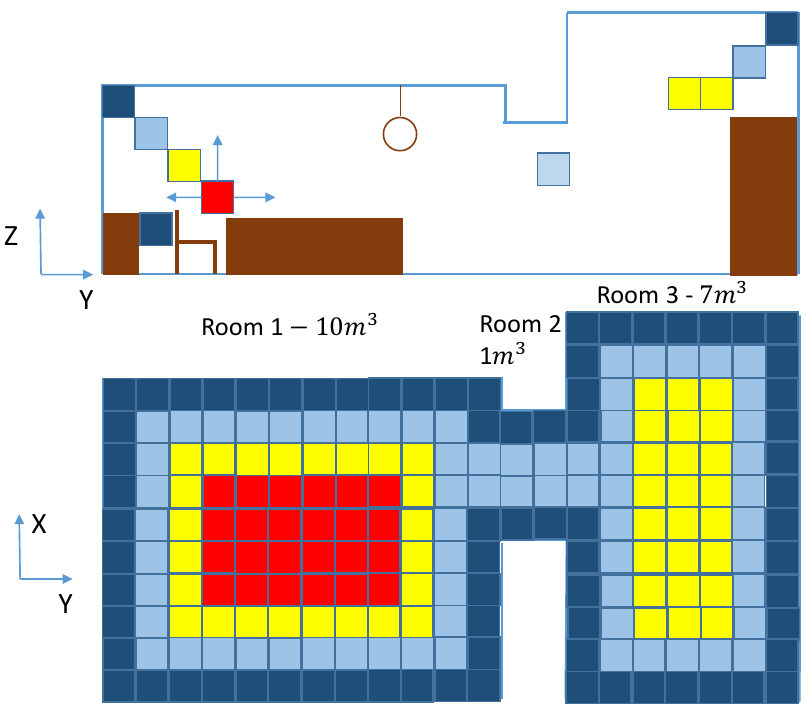
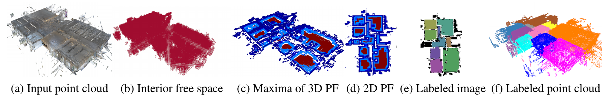
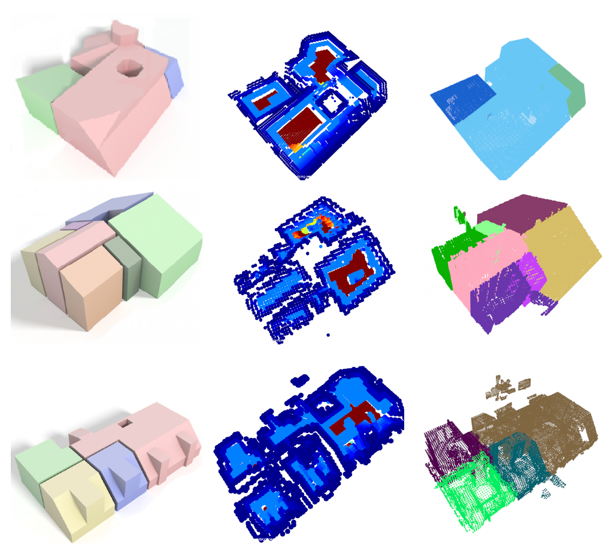
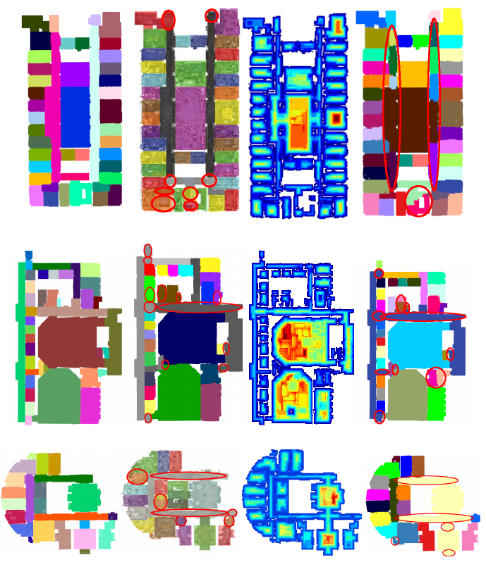
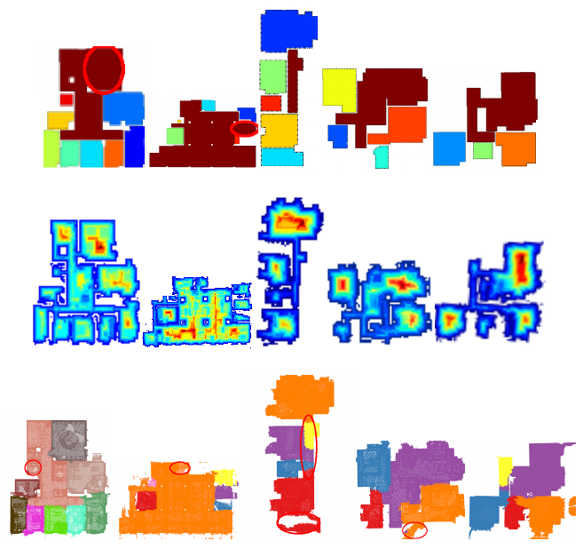

## Abstract

Emerging applications, such as indoor navigation or facility management, present new requirements of automatic and robust partitioning of indoor 3D point clouds into rooms. Previous research is either based on the Manhattan-world assumption or relies on the availability of the scanner pose information. We address these limitations by following the architectural definition of a room, where the room is an inner free space separated from other spaces through openings or partitions. For this we formulate an anisotropic potential field for 3D environments and illustrate how it can be used for room segmentation in the proposed segmentation pipeline. The experimental results confirm that our method outperforms state-of-the-art methods on a number of datasets including those that violate the Manhattan-world assumption. 

## Main contributions

1. Framework to compute interior free space without assuming knowledge of scanner poses or the Manhattan-world structure of indoor environments.
2. 3D formulation of anisotropic PF computation for free space that is robust to the impact of clutter and occlusion and makes no assumptions on the room layout.

For full-text of the paper, see <a href="http://www.lmt.ei.tum.de/forschung/publikationen/dateien/Bobkov2017Roomsegmentationin3D.pdf"> Preprint </a> or <a href="http://ieeexplore.ieee.org/document/8019484/">IEEE version</a>. For short overview, you can also see <a href="assets/poster.pdf">A3 poster</a>.

## Basic intuition

*Illustration of rooms as inner free spaces separated by smaller openings. Top: side view of an indoor environment with two rooms separated by a smaller room (corridor). Furniture is shown in brown, several free voxels with potential field (PF) values are also shown. Bottom: top-down view with proposed anisotropic PF maximum values along the vertical voxel stack. For voxels, red corresponds to high PF values and dark blue to low.*

## Overview of the pipeline

*Overview of the proposed method*

## Results

### Dataset

Raw pointcloud of the entire buildings (3 used buildings with XYZ and RGB information for each point) can be accessed here http://www.lmt.ei.tum.de/fileadmin/user_upload/bobkov/Object_segmentation_dataset/object_segmentation_building_dataset.zip

### Results for Mura et al. [1] dataset

*Results for the dataset violating the Manhattan-world assumption [1]. Top row: Modern, middle row: Cottage, bottom row: Penthouse. Left: reconstruction result of [1], middle: PF map, right: our result.*

### Results for Armeni et al. [2] dataset

*Fig. 4: Results for the large-scale dataset of [2]. From left to right: ground truth, results of [2], our PF map, our labeling result. Top row: Area 1, middle row: Area 2, bottom row: Area 3. Here with red ellipses we denote erroneously labeled rooms.*

### Results for Ikehata et al. [3] dataset

*Results for the dataset of [3]. From left to right: Office 1, Office 2, Apartment 1, Apartment 2, Apartment 3. Top row: results of [3], middle row: our PF map, bottom row: our labeling result. Red ellipses denote erroneously labeled rooms.*

## References
1.  C. Mura, O. Mattausch, and R. Pajarola, “Piecewise-planar reconstruction of multi-room interiors with arbitrary wall arrangements,” Computer Graphics Forum, vol. 35, no. 7, pp. 179–188, October 2016.
2.  I. Armeni, O. Sener, A. R. Zamir, H. Jiang, I. Brilakis, M. Fischer, and S. Savarese, “3d semantic parsing of large-scale indoor spaces,” in IEEE Conference on Computer Vision and Pattern Recognition, June 2016, pp. 1534–1543.
3.  S. Ikehata, H. Yang, and Y. Furukawa, “Structured indoor modeling,” in IEEE International Conference on Computer Vision, December 2015, pp. 1323–1331.
